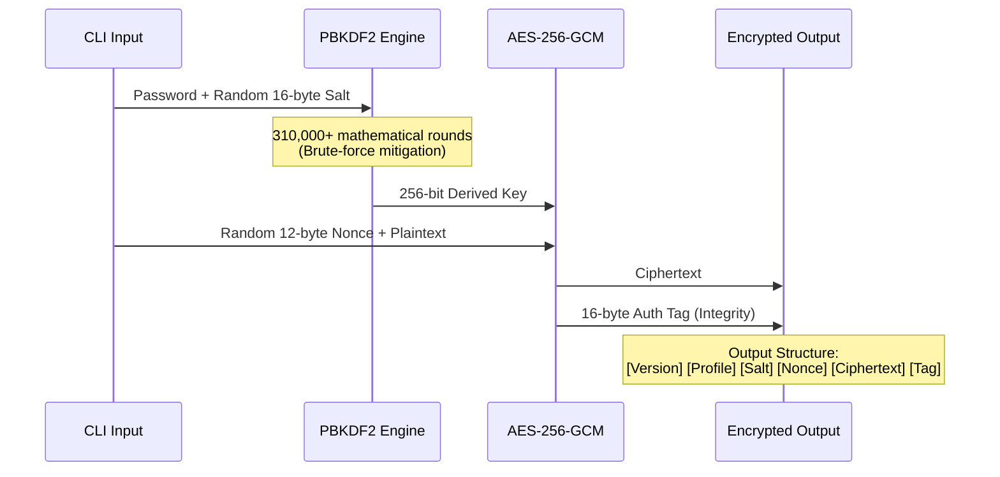

<div align="center">


# SECURE.FS
**Advanced Cryptographic Orchestration & Anti-Forensic Deletion Engine**

> "Security is not a feature. It is a strictly enforced architectural boundary."

</div>

---

## SYSTEM OVERVIEW

In an era of rampant data compromise, standard OS-level permissions are fundamentally broken. SecureFS is a terminal-native, high-performance file security engine engineered in Java. It operates on the principle of absolute cryptographic isolation and zero-trust data handling.

Rather than relying on closed-box third-party GUI tools, SecureFS provides an auditable, extensible, and mathematically rigorous pipeline for file encryption, integrity verification, and anti-forensic data destruction. Every component—from the command-line interface to the AES-GCM engine—is entirely decoupled, communicating only via strict interfaces wired together at runtime.

---

## CYBERSECURITY ARCHITECTURE

SecureFS does not just hide data; it actively defends against specific, modern cryptographic attack vectors.

* **Brute-Force Mitigation:** User passwords are fed into a **PBKDF2** engine alongside a 16-byte random salt. By forcing 310,000+ mathematical rounds, the system introduces artificial latency that makes automated offline password-cracking computationally unviable.
* **Authenticated Encryption:** Data is encrypted using **AES-256-GCM**. Unlike standard CBC mode, GCM provides both absolute confidentiality and tamper-proof integrity.
* **Tamper-Evident Architecture:** The AES-GCM process appends a 16-byte Authentication Tag. During decryption, if a single bit has been altered or maliciously flipped, validation fails instantly, yielding zero output.
* **Memory Isolation:** Passwords are read directly into `char[]` arrays, which are manually overwritten in memory with null characters the millisecond cryptographic derivation is complete.

---

## CRYPTOGRAPHIC DATA FLOW

When a file is encrypted, the system processes it through a strict, deterministic sequence to ensure maximum entropy and integrity validation upon decryption.



*During decryption, the system reverse-engineers this exact flow. The pre-pended Version and Profile bytes dynamically determine the parameters needed to reverse the algorithm.*

---

## DEVELOPER API & EXTENSIBILITY

SecureFS is designed for seamless extensibility. The core logic relies on heavily abstracted interfaces, meaning you can swap out algorithms without touching the orchestration layer.

### The Core Interfaces
```java
public interface EncryptionStrategy {
    EncryptionResult encrypt(byte[] plaintext, char[] password);
    byte[] decrypt(byte[] ciphertext, char[] password);
}
```

### Repository Structure
```text
securefs/
├── build.gradle
└── src/main/java/com/securefs/
    ├── core/                          # Base interfaces, domain models, exceptions
    ├── profile/                       # Dynamic security profiles & KDF strengths
    ├── crypto/                        # AesGcmEncryptionStrategy, Pbkdf2KeyDerivation
    ├── hash/                          # Sha256 / Sha3-256 Hashing Strategies
    ├── deletion/                      # Multi-pass Secure Deletion implementations
    ├── service/                       # The Orchestration Layer
    ├── factory/                       # Dependency Injection & Wiring
    └── cli/                           # Command Router & Terminal Interface
```

---

## ANTI-FORENSIC DELETION MODES

Standard OS deletion only removes the file pointer. SecureFS implements distinct deletion strategies to handle data permanence at the sector level.

| Mode | Operation | Use Case |
| :--- | :--- | :--- |
| `NORMAL` | Standard OS-level deletion. Fast, but data remains in memory sectors until overwritten. | Quick cleanup, non-sensitive data. |
| `SECURE` | Overwrites file contents with random byte streams prior to OS deletion. | Standard hard disk drives (HDDs). |
| `SMART` | Randomizes filename -> Truncates structure -> Overwrites with random data -> Deletes. | Maximum security against metadata and header leakage. |

> **IMPORTANT SSD WARNING:** Due to wear-leveling algorithms on modern Solid State Drives, software secure deletion cannot guarantee the exact physical NAND gate is overwritten. For absolute physical destruction, hardware-level secure erase or full-disk encryption is required.

---

## DEPLOYMENT & EXECUTION GUIDE

### 1. Build the Engine
Clone the repository and compile the JAR using Gradle.
```bash
git clone [https://github.com/your-username/securefs.git](https://github.com/your-username/securefs.git)
cd securefs
./gradlew jar
```

### 2. Configure Alias (Optional)
For a terminal-native workflow, map the JAR to a global command:
```bash
alias securefs='java -jar /path/to/securefs/build/libs/securefs.jar'
```

### 3. Encrypt Payload
```bash
securefs encrypt --input payload.txt --output payload.enc --profile STANDARD
# Enter password: (typed, not echoed)
# [SUCCESS] Output: payload.enc | Profile: STANDARD | Algo: AES-256-GCM
```

### 4. Decrypt Payload
```bash
securefs decrypt --input payload.enc --output payload_decrypted.txt
# Enter password: (typed, not echoed)
# [SUCCESS] Output: payload_decrypted.txt
```

### 5. Generate Cryptographic Hash
```bash
securefs hash --input payload.txt
# file:      payload.txt
# algorithm: SHA-256
# digest:    e3b0c44298fc1c149afbf4c8996fb92427ae41e4649b934ca495991b7852b855
```

### 6. Verify Integrity
```bash
securefs verify --input payload.txt --expected e3b0c44298fc1c149afbf4c8996fb92427ae41e4649b934ca495991b7852b855
# [VERIFIED] Digest matches perfectly.
```

### 7. Execute Anti-Forensic Wipe
```bash
securefs delete --input target_file.txt --mode SMART
# Deleted:    target_file.txt
# Mode:       SMART (Rename -> Truncate -> Overwrite -> Delete)
# Confidence: High (Subject to SSD wear-leveling caveats)
```

---

<div align="center">

### DEVELOPED BY
**Nishant | Nirvan | Tanvi | Kavya**

*Engineered with precision for absolute data security.*

[GitHub](https://github.com/your-username) | [Report a Vulnerability](mailto:your-email@example.com)

</div>
